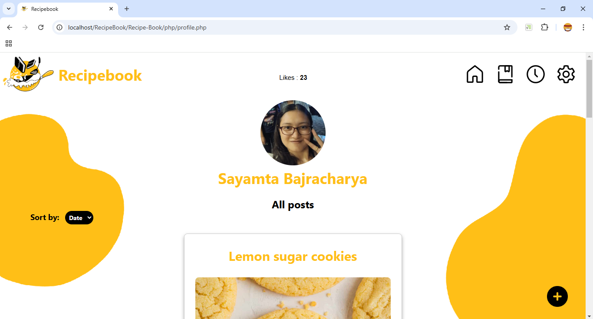

# Recipebook – A Social Media Platform for Sharing Recipes

## Abstract

**Recipebook** is a web-based social media platform designed exclusively for food enthusiasts to share and explore recipes, and interact with the community. Users can post recipes using a structured template and engage through likes, comments, and bookmarks. The system also includes advanced search functionality, allowing users to find recipes by title, username, hashtags, or category.

Developed using the **Waterfall model**, the platform integrates **HTML, CSS, JavaScript** on the front end, and **PHP with MySQL** on the back end. While the project is complete, there is room for future improvements.

## Table of Contents

- [Problem Statement](#problem-statement)
- [Objectives](#objectives)
- [Scope](#scope)
- [Limitations](#limitations)
- [Use Case Diagram](#use-case-diagram)
- [Technologies Used](#technologies-used)
  - [Front-End](#front-end)
  - [Back-End](#back-end)
- [Screenshots](#screenshots)
- [Demo Video](#demo-video)
- [Conclusion](#conclusion)
- [Future Recommendations](#future-recommendations)

## Problem Statement

- **Lack of a Dedicated Food Community**      
    General social media platforms make it difficult for food lovers to find recipes and connect.

- **No Recipe Templates**      
    Existing platforms don’t support structured recipe formatting, leading to cluttered posts.

- **Limited Recipe Search Tools**      
    Users cannot filter recipes based on title, tags, or ingredients.

- **Minimal Interaction on Food Websites**      
    Traditional recipe websites lack interactive features like likes, comments, and bookmarks.

## Objectives

To build a web application where users can:

- Share recipes using a pre-designed template  
- Search for recipes using recipe title, username, hashtags, or categories  
- Interact with each other through likes, comments, and bookmarks

## Scope

- **Structured Recipe Posting**    
    Recipes are added via a clean and organized form layout.

- **Advanced Search Feature**    
    Users can filter recipes by recipe title, username, hashtags, or categories.

- **Community Engagement**    
    Users can like, comment on, and bookmark favorite recipes.

## Limitations

- **No Real User Feedback**    
    All accounts and activity are simulated; no real user testing was conducted.

- **Not Deployed Online**    
    The platform is not hosted, so scalability and performance are untested.

- **Missing Features**    
    Real-time notifications, multiple images per post, and ingredient-based searches are not implemented.

## Use Case Diagram

### Use Cases of User

- **Signup and Login** - Users can create an account by providing details like username, email, and password. Registered users can log in with their credentials.

- **Manage Profile** - Users can update or delete their profile picture and change their password.

- **Search Recipe Post** - Recipes can be searched using keywords such as title, username, hashtags, or category.

- **Add Recipe Post** - Users can submit a new recipe with an image, title, ingredients, preparation steps, hashtags, category, and a personal note.

- **Edit Recipe Post** - Users can edit the recipes they have posted.

- **Delete Recipe Post** - Users can delete their own recipe posts.

- **Sort Recipe Post** - Users can sort recipe listings based on post date or number of likes.

- **Like Recipe Post** - Users can like any recipe post.

- **Comment on Recipe Post** - Users can leave comments on any recipe post.

- **Bookmark Recipe Post** - Users can save/bookmark recipes to view later.

- **Logout** - Users can securely log out from the website.

### Use Cases of Admin

- **Login** - Admin can log in using their credentials.

- **Manage Users** - Admin can delete user accounts.

- **Manage Posts** - Admin can approve or disapprove recipes submitted by users. Admin also has the ability to delete user posts.

- **Manage Comments** - Admin can remove user comments if necessary.

- **Logout** - Admin can securely log out of the system.

## Technologies Used

### Front-End
- HTML
- CSS
- JavaScript

### Back-End
- PHP
- MySQL

## Screenshots

> Below are some screenshots of the website interface and admin dashboard:

### Home Page
 

 

 

### Sign Up Page
 

### Log In Page
 

### Home Feed
 

### Add Recipe Page
 

### Pending Post Page
 

### Comments Modal
 

### Adding Post to Favourite
 

### Favourites Page
 

### Profile Page
 

### Search Functionality
 

### Manage User Profile Page
 

### Admin Dashboard
 

 

 

 

 

## Demo Video

> Watch the working demo of Recipebook by clicking the image below:

## Conclusion

Recipebook successfully provides a dedicated and interactive environment for food lovers to share and discover recipes. It combines essential social media features with structured recipe management, offering a user-friendly experience despite limitations in scalability and testing.

## Future Recommendations

Several areas have been identified for future improvements:

- Add video support for recipe instructions  
- Allow multiple images per recipe  
- Implement real-time notifications  
- Add prep time, serving size, and tips in the recipe template  
- Enable ingredient-based recipe search  
- Introduce a recipe rating system  
- Expand to include food tips and experiences  
- Enable user profile viewing and following  
- Add real-time chat functionality

## Contact Us

This project was collaboratively developed by:

- [Nitika Maharjan](https://github.com/NitikaMaharjan)

  email: [maharjanitika@gmail.com](https://mail.google.com/mail/?view=cm&fs=1&to=maharjanitika@gmail.com)

    - Designed and implemented the navigation bar and major UI components across pages.
    - Built `home.php`, `edit_post.php`, and `delete_post.php` for displaying and managing user posts.
    - Implemented profile picture features (add, delete, update), password update, and comment removal.
    - Developed server-side validation and alert messages for signup and login forms.
    - Added search by title and username, and sorting recipes by date.
    - Styled key pages including `add_post`, `edit_post`, `profile`, `homeforall`, and all admin pages.
    - Created custom visuals including the Recipebook logo, and background.
    - Added UI elements like “About” pop-up boxes and comment modals for enhanced user experience.
 
- [Rohan Kasichhwa](https://github.com/Rohankasichhwa2023)

  email: [rohankasichhwa@gmail.com](https://mail.google.com/mail/?view=cm&fs=1&to=rohankasichhwa@gmail.com)

    - Developed authentication features in `signup.php` and `login.php`.
    - Created `add_post.php`, `view_post.php`, and `profile.php` to manage user content.
    - Implemented like/unlike and add-to-favorite functionality for recipes.
    - Built comment system for adding and displaying comments.
    - Implemented search by category and hashtags, and sorting recipes by likes.
    - Created the admin dashboard showing stats for users, likes, posts, and pending posts.
    - Built admin functionalities to approve/disapprove posts and manage user accounts/comments.
    - Ensured proper integration between user actions and backend operations.

Feel free to connect with us on GitHub or reach out via email for feedback, suggestions, or collaboration opportunities.
